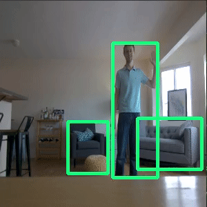

# jetson_nano_detection_and_tracking
Jetson Nano ML install scripts, automated optimization of robotics detection models, and filter-based tracking of detections

<a href="https://www.buymeacoffee.com/stevemacenski" target="_blank"></a>

<p align="center">
  
</p>

## Motivation

Installing and setting up the new Nvidia Jetson Nano was surprisingly time consuming and unintuitive. From protobuf version conflicts, to Tensorflow versions, OpenCV recompiling with GPU, models running, models optimized, and general chaos in the ranks.

This repository is my set of install tools to get the Nano up and running with a convincing and scalable demo for robot-centric uses. In particular, using detection and semantic segmentation models capable at running in real-time on a robot for $100. By convincing, I mean not using Nvidia's 2-day startup model you just compile and have magically working without having control. This gives you full control of which model to run and when. 

In the repository, you'll find a few key things:

### Install of dependencies

Getting the right versions of Tensorflow, protobufs, etc and having everyone play well on the Jetson Nano platform was a big hassle. Hopefully these will help you.

This can be accomplished via `./install.sh` run in the root of this repository, where all the models are going to be installed and linked.

### Download of pretrained models for real-time detection 

Scripts to automatically download pretrained Tensorflow inference graphs and checkpoints, then optimize with TensorRT (which I found as a critical must-have to even *run* on the Nano).

Also there's nothing here that prohibits you from using your own Tensorflow model and then using the same scripts to optimize it with TensorRT and then deploy as described below. I have retrained a model from the zoo and followed these same instructions with equal success (I really needed that additional glass of beer class for... reasons).

### Execution of live detection with an attached MIPI-based camera

This will run the argus streamer for a MIPI camera compatible with the Jetson Nano. There are a number out there available, I happen to use the Raspberry Pi v2.1 camera simply because I had it around from another project and also because its shockingly high resolution for a $20 toy. 

### Filter-based tracking of detections

This uses a constant velocity Kalman Filter to track detections in the image frame and report stabilized detections based on the centroid. This is to handle 2 things. The first is to deal with irregular detections so that a few missing frames doesn't make an upstream application think a person disppeared out of thin air for 57 ms. Secondarily, it acts as smoother so if individual frames detect irraneous things (like an airplane rather than my ear) single frame detections aren't introduced into the system. For robotics applications it would be pretty bad if we saw an airplane in my living room. 

## Walk-through

`jetson_live_object_detection.py` is the main live object detection program. It will take no flags and run in a debug mode with printed statements about detections found and a visualization. The visualization will include the bounding boxes around an object where the line thickness is proportional to confidence. Example use to run an ssd mobilenet v1 trt optimized model in debug mode:

```
python3 jetson_live_object_detection.py ssd_mobilenet_v1_trt_graph.pb True
```

`tf_download_and_trt_model.py` will be your pretrained model savior. You're able to download pretrained models *unoptimized* from zoo and have them placed in the `./data` directory along side the ms coco labels. After download, it will run the TensorRT optimization over them and leave you with a file named `[model]_trt_graph.pb` for use. Example use:

```
tf_download_and_trt_model.py [model]
```

Model options include:
- ssd_mobilenet_v1_coco
- ssd_mobilenet_v2_coco
- ssd_inception_v2_coco

There are other models available, but considering the use-case of this project is real-time detection in robotics, these are your main valid options. I make no warranty of other model uses.
